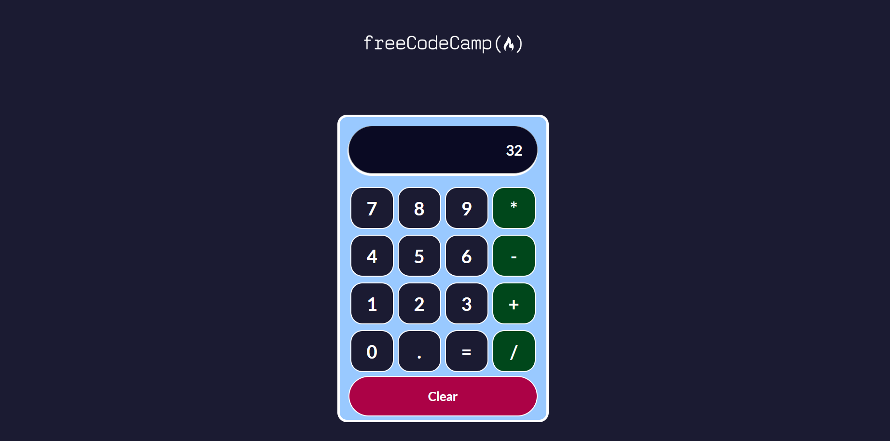

# Proyecto #3 React - Calculadora - freeCodeCamp.org 

Este proyecto fue realizado con  [Create React App](https://github.com/facebook/create-react-app), como práctica para el aprendizaje de esta biblioteca en freeCodeCamp.org.

## Descripción del proyecto
Aplicación que simula la funcionalidad de una calculadora 

## Temas de estudio:
* Estructura de un proyecto en React.
* Componentes.
* Importar y exportar componentes.
* Propiedades: props, paso de funciones en props.
* Destructuración.
* Hooks: Estados (useState).
* Eventos: onClick
* Implementación de otras bibliotecas en el proyecto: mathjs

## Acerca del autor:
* [LinkedIn](https://www.linkedin.com/in/carlos-munera-259969262 "Linkedin")
* [freeCodeCamp.org](https://www.freecodecamp.org/fcc0dc40656-86b6-4bd7-a2b0-5ccd1ae5cc31)

